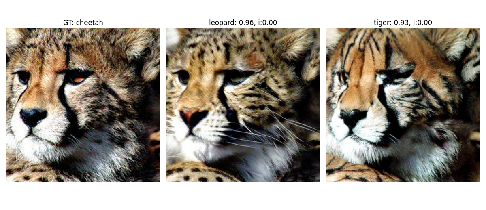
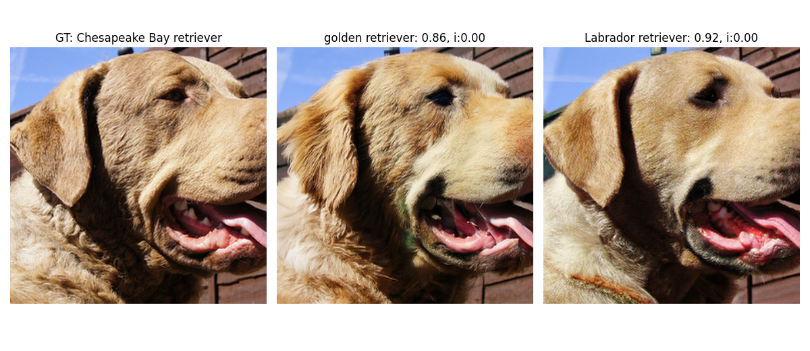
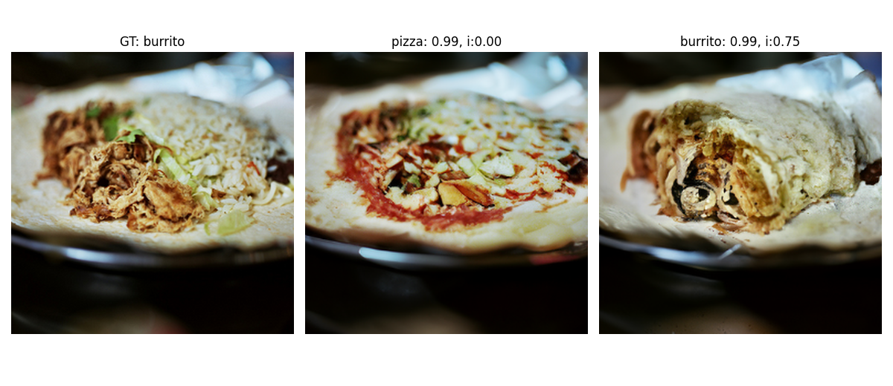

# **Diffusion Visual Counterfactual Explanations**

Welcome to the codebase for our NeurIPS submission *Diffusion Visual Counterfactual Explanations.* We will show you how to generate DVCEs on the selected (and you can choose the targets yourselves) ImageNet images with the multiple norm robust model Madry + FT and two SOTA non-robust models Swin-T and ConvNeXt. 

## Examples of DVCEs for the ConvNeXt classifier

  

  

  

  

  

## Setup

Before we can start with the generation, we have to setup the project and install required packages.

* Start by extracting the content of the .zip file that also contains this readme.md somewhere on your computer. We will refer to the extraction directory as **project_path**.
* Navigate into the  **project_path**

* Download the weights for Madry + FT from [here](https://drive.google.com/file/d/1sUR81A5OckMS0maneU5KWOpc99rCtESR/view?usp=sharing) into your **project_path**
* Unzip the model file via `unzip MadryFT.zip` 

* Execute `cd checkpoints/`
* and `wget https://openaipublic.blob.core.windows.net/diffusion/jul-2021/256x256_diffusion_uncond.pt`

* Set variable *data_folder* variable to the folder that contains imagenet dataset
  For example, if your imagenet folder is located under '/scratch/datasets/imagenet', the use `data_folder='/scratch/datasets'`

* Create a new conda env via `conda env create -f python_38_dvces.yml`
* Activate the conda environment via `conda activate python_38_dvces`
* Install additionally robustbench via `pip install git+https://github.com/RobustBench/robustbench.git`

## Creating  DVCEs/SVCEs/blended diffusion based VCEs

In the following, we show, how to first set the parameters, and then - generate VCEs of the respective type for 6 selected targets. To choose your own image ids and targets, change `some_user_study_vces`, but consider targets that are semantically close to the original image, to ensure that meaningful explanations (VCEs) can be generated.

For any of the proposed parameter settings, feel free to adjust the values, but these are the ones we have used mostly in the paper.

* Generating DVCEs without cone projection for Madry + FT via
  `seeds=(1);cl_coeffs=(0.1);skips=(100);steps=200;classifier_t=3;second_classifier_ts=(-1);regs=(0.15);bs=6;nim=6;gpu=4;lp='1.0'` 
   and then
  `for seed in "${seeds[@]}"; do for coeff_class in "${cl_coeffs[@]}"; do for skip in "${skips[@]}"; do for second_classifier_t in "${second_classifier_ts[@]}"; do for reg in "${regs[@]}"; do python imagenet_VCEs.py --seed $seed --gen_type 'p_sample' --classifier_type $classifier_t --second_classifier_type $second_classifier_t --enforce_same_norms --background_preservation_loss --gpu $gpu --batch_size $bs --num_imgs $nim --classifier_lambda $coeff_class  --clip_guidance_lambda 0 --lp_custom $lp --lp_custom_value $reg --range_lambda 0 --lpips_sim_lambda 0 --l2_sim_lambda 0 --timestep_respacing $steps --skip_timesteps $skip --method 'dvces' --data_folder $data_folder > logs/log; done; done; done; done; done;`  

* Generating DVCEs with the cone projection for Madry + FT and respectively Swin-T (model id is 30) and ConvNeXt (model id is 31) via
  `second_classifier_ts=(30 31)`
  and then
  `for second_classifier_t in "${second_classifier_ts[@]}"; do for reg in "${regs[@]}"; do python imagenet_VCEs.py --seed $seed --deg_cone_projection $deg  --projecting_cone --gen_type 'p_sample' --classifier_type $classifier_t --second_classifier_type $second_classifier_t --enforce_same_norms --background_preservation_loss --gpu $gpu --batch_size $bs --num_imgs $nim --classifier_lambda $coeff_class  --clip_guidance_lambda 0 --lp_custom $lp --lp_custom_value $reg --range_lambda 0 --lpips_sim_lambda 0 --l2_sim_lambda 0 --timestep_respacing $steps --skip_timesteps $skip --method 'dvces' --data_folder $data_folder > logs/log; done;`

* Generating SVCEs for Madry + FT via
  `seeds=(1);classifier_t=3;bs=6;nim=6;gpu=4;`
  and then
  `for seed in "${seeds[@]}"; do python imagenet_VCEs.py --seed $seed --classifier_type $classifier_t --gpu $gpu --batch_size $bs --num_imgs $nim --method 'svces' --data_folder $data_folder > logs/log; done;` 

* Generating blended diffusion based VCEs via
  `seeds=(1);cl_coeffs=(25);skips=(25);steps=100;classifier_t=3;second_classifier_ts=(-1);bs=6;nim=6;gpu=4;`
  and then
  `for seed in "${seeds[@]}"; do for coeff_class in "${cl_coeffs[@]}"; do for skip in "${skips[@]}"; do for second_classifier_t in "${second_classifier_ts[@]}"; do python imagenet_VCEs.py --seed $seed --gen_type 'p_sample' --classifier_type $classifier_t --second_classifier_type $second_classifier_t --background_preservation_loss --gpu $gpu --batch_size $bs --num_imgs $nim --classifier_lambda $coeff_class  --clip_guidance_lambda 0 --range_lambda 50 --lpips_sim_lambda 1000 --l2_sim_lambda 10000 --timestep_respacing $steps --skip_timesteps $skip --method 'dvces' --use_blended --data_folder $data_folder > logs/log; done; done; done; done;`

The batchsize argument `--bs` is the number of samples per gpu, so if you encounter out-of-memory errors you can reduce it without altering results.

The resulting images can be found in `ImageNetVCEs/examples/`.
